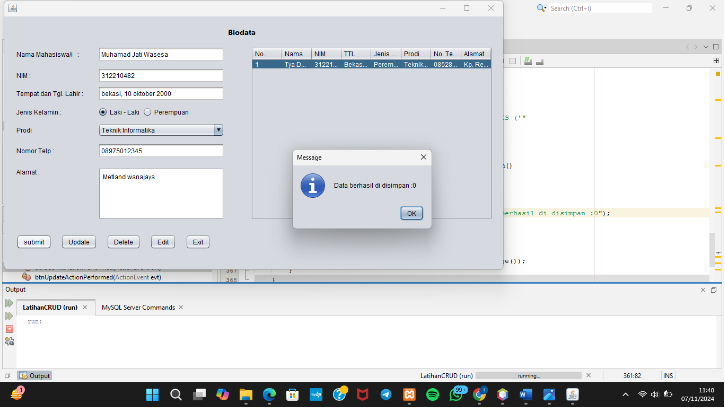
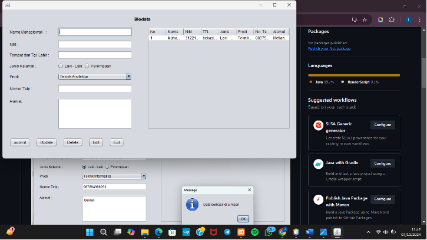
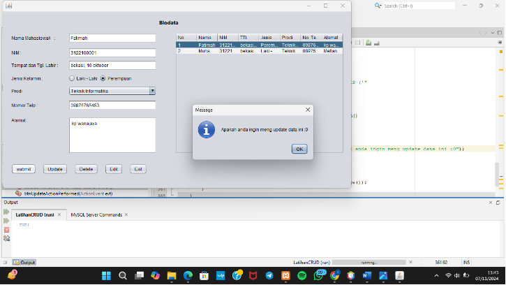
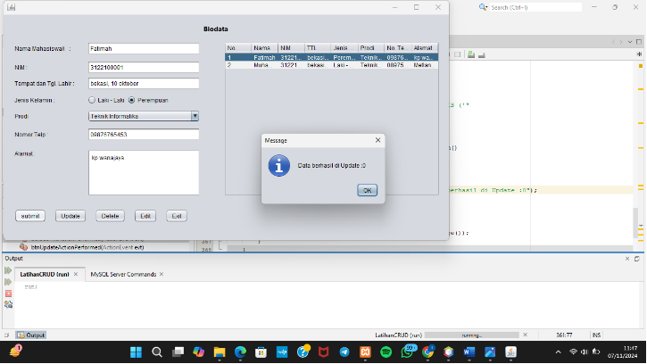
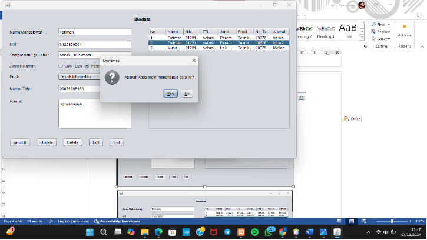
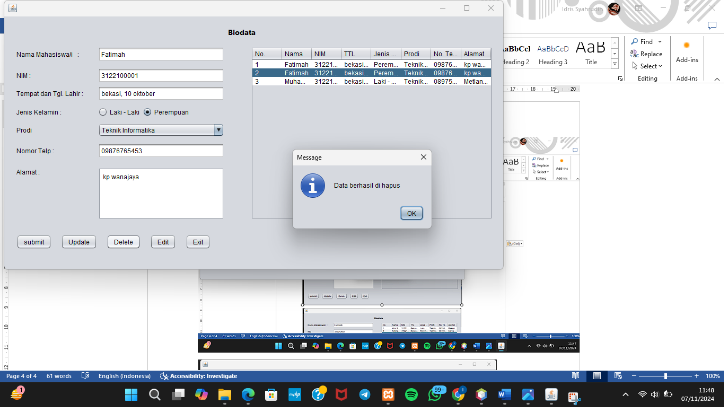

 
**

**PROGRAM STUDI TEKNIK INFORMATIKA** 

**FAKULTAS TEKNIK** 

**UNIVERSITAS PELITA BANGSA** 

` `**![ref1]**	 	 	 	 	 
# UJIAN TENGAH SEMESTER GANJIL TA 2024/2025 

` 	`Mata Kuliah  	 	:  Pemrograman Visual 

` 	`Program Studi/Semester 	:  Teknik Informatika  

` 	`Hari/Tanggal  		            :   07/11/2024	

` 	`Nama Dosen  	 	:  Eko Budiarto, S.Kom., M.M. 

` 	`Kelas  	 	 	:  TI.22.A4 

![ref1]

||**LEMBAR JAWABAN** |
| :- | :- |
|
 

Nama Lengkap 
|
 	 

: Muhamad Jati Wasesa
|
|NIM |: 312210481|

**Laporan Praktikum 6&7 Pemrograman Visual** 

 
## **1. Input Data** 

 

## **2. Update Data** 

## **3. Delete Data** 

**

**

[ref1]: Aspose.Words.6dee9f92-8189-4acb-a0ea-ab5dd2a6a217.002.png
